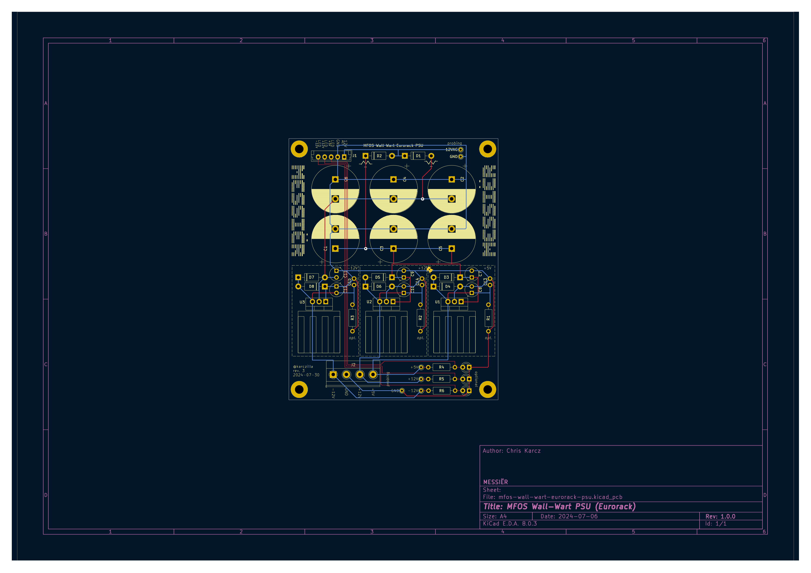
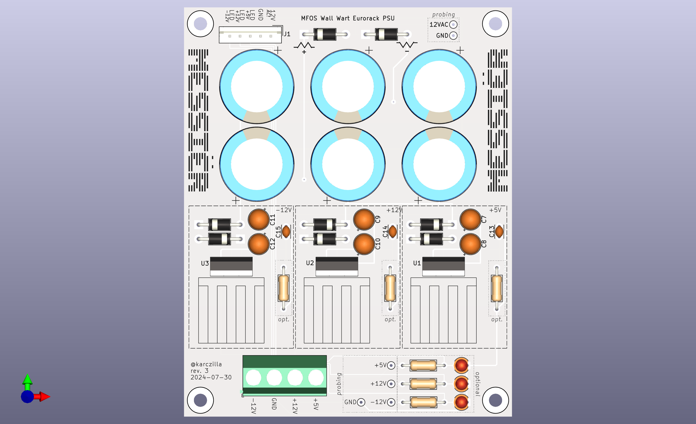

# MFOS Wall Wart PSU For Eurorack

Basic wall wart design but with eurorack power rails + connector. Sub 100mm desing for cheap PCB manufactoring.

[Based on Ray Wilson's PSU circuit](https://shop.musicfromouterspace.com/cart/mfos-wall-wart-bipolar-power-supply).

# Schematic

# PCB

